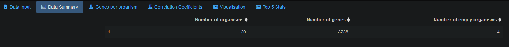
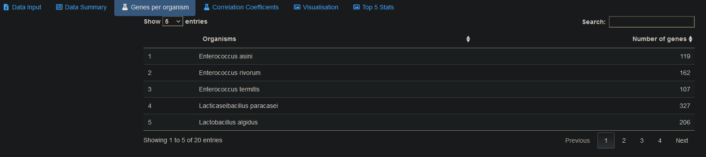
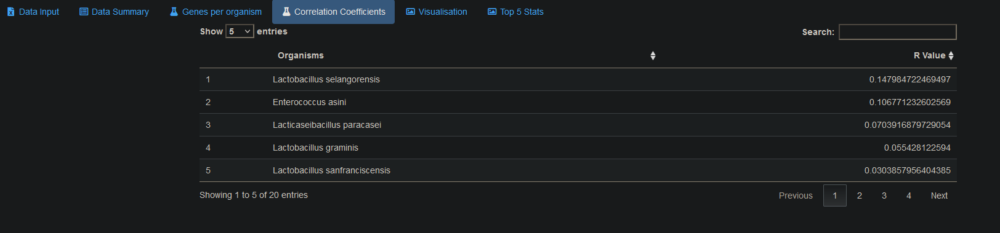
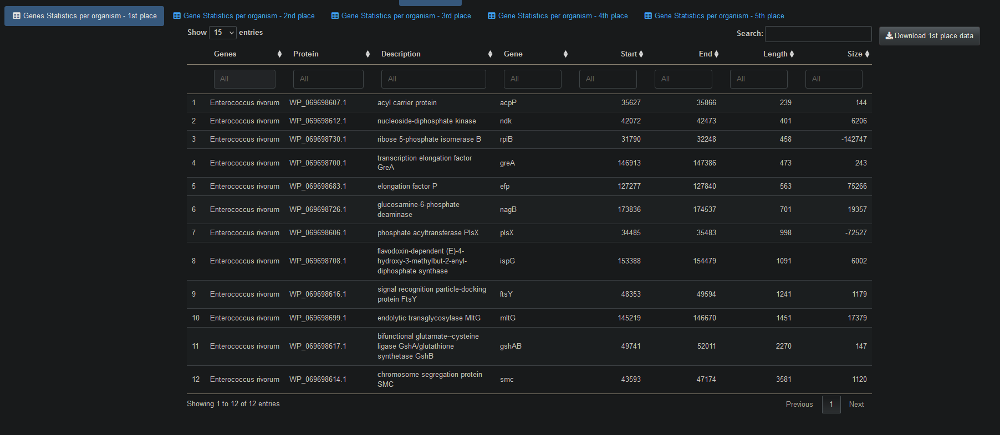

---

<!-- README.md is generated from README.Rmd. Please edit that file -->

```{r, include = FALSE}
knitr::opts_chunk$set(
  collapse = TRUE,
  comment = "#>",
  fig.path = "man/figures/README-",
  out.width = "100%"
)
```

<!-- badges: start -->
<!-- badges: end -->

The package `GilOG` does a number of tasks: 


First, this package uses calculates gene length and size.

Next, this package calculates correlation efficients and displays the data in a boxplot, scatterplot, regression lines, correlation efficients, both overall and  Top 5.

It executes the processing using R Shiny's reactivity functionality using HTML coding in `ui.R` and `global.R` to improve the appearance of the UI.


## Installation

You can install the released version of `GilOG` with:

``` r
devtools::install_github("EdwardJGillian/GilOG")
```

## Running the package

You can run `GilOG` by opening `global.R` in the `GilOG/inst` folder.

## Example

This is a basic example of the workflow with package functions. We will start by getting the data needed for the package:

  
```{r loadfiles}
library(dplyr)
library(tidyr)
library(ggplot2)
library(GilOG)
# There are two example files within the package: 
# set the file paths and file names
org_file_path <- system.file("extdata", "organisms.csv", package = "GilOG", mustWork = TRUE)
# org_file_path <- file.path(home, "extdata/organism.rds")
gene_file_path <- system.file("extdata", "genes.csv", package = "GilOG", mustWork = TRUE)

# load organism data and convert empty strings to NA
organism <- read.csv(org_file_path, na.strings = "")
# load genes data and convert empty strings to NA
genes <- read.csv(gene_file_path, na.strings = "")
```

The `GilOG` package loads two files `organism` and `genes` and validates them for number of columns and column headings.
Examples can be found in the `inst/extdata` folder.

First, we will prepare the summary data count:

```{r summmary_data_count}
# Data summary count
summary_count_df <- GilOG::summary_count_processing(organism, genes)

head(summary_count_df)
```
### Screenshot of Data summary

{width=100%}

Next, we will prepare the genes per organism count:

```{r gpo_count}
# Genes per organism count
gpo_count_df <- GilOG::gpo_processing(organism, genes)
head(gpo_count_df)
```

### Screenshot of genes per organism

{width=100%}
Next, we will prepare the genes lengths and sizes:

```{r gpo_length_size}
# create data frame with gene lengths and sizes
gpo_length_size <- GilOG::gene_length_size_calc(organism, genes)
head(gpo_length_size)
```

Next, we will calculate correlation coefficients:

```{r coef}
# calculate correlation coefficients
co_ef_df <- GilOG::cor_processing(gpo_length_size)
head(co_ef_df)
```

### Screenshot of correlation coefficients

{width=100%}

Next, we will calculate top 5 correlation coefficients:

```{r top_5_coef}
# calculate correlation coefficients top 5
gpo_length_size_top_5 <- GilOG::cor_processing_top_5(gpo_length_size)
head(gpo_length_size_top_5)
```

Next, we will calculate and display the box plot
```{r boxplot}
# calculate and display box plot
      gpo_box <- gpo_length_size_top_5 %>%
         dplyr::mutate_at(vars(organism), as.factor)
p <- ggplot2::ggplot(gpo_box, aes(x=organism, y=gene_length, fill=organism)) +
            geom_boxplot() +
            labs(title="Plot of length per Organism",x="Organism", y = "Length")
         p + theme(
            plot.title = element_text(color="red", size=14, face="bold.italic"),
            axis.title.x = element_text(color="blue", size=14, face="bold"),
            axis.title.y = element_text(color="#993333", size=14, face="bold")
         )

```

Next, we will calculate and display the scatterplot
```{r scatterplot}
# calculate and display correlation coefficients in a scatterplot
      GilOG::cor_scatterplot(gpo_length_size_top_5)

```

Next, we will calculate and display the Regression Curves

```{r regression}
p <- ggplot2::ggplot(gpo_length_size_top_5, aes(x=gene_size, y=gene_length, color=organism)) +
            geom_point() +
            geom_smooth(method = "lm", fill = NA) +
            geom_smooth(method = 'lm',size = 1, colour = 'black', se = F, linetype = "dashed") + theme_bw() +
            labs(title="Regression Curves per Organism",x="Size", y = "Length")
         p + theme(
            plot.title = element_text(color="red", size=14, face="bold.italic"),
            axis.title.x = element_text(color="blue", size=14, face="bold"),
            axis.title.y = element_text(color="#993333", size=14, face="bold")
         )
```

Finally, tables of gene statistics per organism are displayed for the top 5 correlation coefficients.

```{r top_5_coef_display}
# calculate correlation coefficients top 5 - 1st place
group_id <- as.double(1)
top_5_coef_display_1st_place <- GilOG::gpo_output_processing(gpo_length_size_top_5, group_id)
head(top_5_coef_display_1st_place)
```

{width=100%}

## Organisgenes flowchart

This flowchart shows the package workflow visually.


```{r organism_genes, echo=FALSE, message=FALSE, warning=FALSE}
library(DiagrammeR)
DiagrammeR::grViz("digraph{

      graph[rankdir = LR, nodesep=.2, ranksep=.8]
  
      node[shape = rectangle, style = filled, fontsize=12]
  
      subgraph cluster_0 {
        graph[shape = rectangle]
        style = rounded
        bgcolor = Green
        fontsize = 72
        label = 'Start Processing'
        node[shape = rectangle, fillcolor = LemonChiffon, margin = 0.1, fontsize=72]
        read_files[label = 'read_files', shape = folder, fillcolor = '#FF6347', fontsize=48]
      }
  
      subgraph cluster_1 {
         graph[shape = rectangle]
         style = rounded
         bgcolor = Green
         fontsize = 72
         label = 'GilOG \n Processing Functions'
         node[shape = rectangle, fillcolor = LemonChiffon, margin = 0.25, fontsize = 48, nodesep=1.5]
         GilOG_proc_D[label = 'summary_count_processing()']
         GilOG_proc_E[label = 'gpo_processing()']
         GilOG_proc_F[label = 'gene_length_size_calc()']
         GilOG_proc_G[label = 'cor_processing()']
         GilOG_proc_H[label = 'cor_processing_top_5()']
         GilOG_proc_I[label = 'gpo_output_processing()']
      }
  
      subgraph cluster_3 {
         graph[shape = rectangle]
         style = rounded
         bgcolor = Green
         fontsize = 72
         label = 'GilOG \n Display Functions'
         node[shape = rectangle, fillcolor = LemonChiffon, margin = 0.25]
         GilOG_disp_I[label = 'Data summary', shape = display, fillcolor = '#FF6347', fontsize = 48]
         GilOG_disp_J[label = 'Genes Per Organism', shape = display, fillcolor = '#FF6347', fontsize = 48]
         GilOG_disp_K[label = 'Correlation coefficients', shape = display, fillcolor = '#FF6347', fontsize = 48]
         GilOG_disp_L[label = 'Box Plot', shape = display, fillcolor = '#FF6347', fontsize = 48]
         GilOG_disp_M[label = 'Scatter Plot', shape = display, fillcolor = '#FF6347', fontsize = 48]
         GilOG_disp_N[label = 'Regression Curves', shape = display, fillcolor = '#FF6347', fontsize = 48]
         GilOG_disp_O[label = 'Genes Per Organism Stats - Top 5', shape = display, fillcolor = '#FF6347', fontsize = 48]
      }
  
      edge[color = black, arrowhead = vee, arrowsize = 1.25]
      
      read_files -> GilOG_proc_D  
      GilOG_proc_D -> {GilOG_proc_E GilOG_disp_I}
      GilOG_proc_E -> {GilOG_proc_F GilOG_disp_J} 
      GilOG_proc_F -> GilOG_proc_G
      GilOG_proc_G -> GilOG_proc_H
      GilOG_proc_H -> {GilOG_proc_I GilOG_disp_K GilOG_disp_L GilOG_disp_M GilOG_disp_N}
      GilOG_proc_I -> GilOG_disp_O
      }")
```

### GilOG package input parameters

```{r input_table, echo = FALSE}
library(knitr)
library(kableExtra)
library(magrittr)
input_table <-
  data.frame(
    "File" = c(
      "organism",
      "genes"
   ),
   "DataType" = c(
      "CSV",
      "CSV"
    )
  )

input_html <- knitr::kable((input_table), "html")
kableExtra::kable_styling(input_html, "striped", position = "left", font_size = 10) %>%
  kableExtra::row_spec(0, bold = TRUE, italic = TRUE, background = "red")

```

### GilOG package Function Parameters

```{r ogp_function_table, echo = FALSE}
library(knitr)
library(kableExtra)
library(magrittr)
OGP_function_table <-
  data.frame(
    "Function" = c(
      "summary_count_processing()",
      "gpo_processing()",
      "gene_length_size_calc()",
      "cor_processing()",
      "cor_processing_top_5()",
      "gpo_output_processing()"
    ),
    "Function Purpose" = c(
      "creates the a dataframe with the counts in various categories",
      "Create genes per organism count",
      "Calculates the gene length and size",
      "Performs correlation calculations",
      "Performs correlation calculations to find the 5 strongest relationships",
      "This function prepares output stats for the GPO stats tables by filtering the data by group ID"
    )
  )

OGP_html <- knitr::kable((OGP_function_table), "html")
kableExtra::kable_styling(OGP_html, "striped", position = "left", font_size = 10) %>%
  kableExtra::row_spec(0, bold = TRUE, italic = TRUE, background = "green")
```
## Testing the package

As shown by the code below, a chained function using `purrr::map2` is created to loop through two file lists of example data to test the core functions to be tested for reliable outputs. This function creates a series of reference files automatically

```
library(GilOG)
library(testthat)

test_chained_functions <- function(csv_file1, csv_file2) {
   test_that("check file values for parameters", {
      # naming helper
      tname <- function(n) {
         paste0(home,
                "/data/known_value/",
                csv,
                ".",
                n,
                ".test"
         )
      }

      # create file path to csv file examples

      csv_path1 <-
         paste0(home, "/data/csv_examples/", csv_file1)
      csv <- stringr::str_remove(csv_file1, ".csv")
      df1 <- as.data.frame(read.csv(file=csv_path1, na.strings = ""))

      csv_path2 <-
         paste0(home, "/data/csv_examples/", csv_file2)
      df2 <- as.data.frame(read.csv(file=csv_path2, na.strings = ""))

      organism <- GilOG::dataframe_preprocessing(df1)

      # SuppressWarnings used as expect_known_value is a deprecated function
      suppressWarnings(testthat::expect_known_value(
         organism, tname("organism")))

      genes <- GilOG::dataframe_preprocessing(df2)

      # SuppressWarnings used as expect_known_value is a deprecated function
      suppressWarnings(testthat::expect_known_value(
         genes, tname("genes")))

      # dplyr needs to be run inside testthat for function to work
      # generates a warning
      suppressWarnings(library(dplyr))
      summary_count_df <- GilOG::summary_count_processing(organism, genes)

      # SuppressWarnings used as expect_known_value is a deprecated function
      suppressWarnings(testthat::expect_known_value(
         summary_count_df, tname("summary_count_df")))

      gpo_length_size <- GilOG::gene_length_size_calc(organism, genes)

      # SuppressWarnings used as expect_known_value is a deprecated function
      suppressWarnings(testthat::expect_known_value(
         gpo_length_size, tname("gpo_length_size")))

      co_ef_df <- GilOG::cor_processing(gpo_length_size)

      # SuppressWarnings used as expect_known_value is a deprecated function
      suppressWarnings(testthat::expect_known_value(
         co_ef_df, tname("co_ef_df")))

      gpo_length_size_top_5 <- GilOG::cor_processing_top_5(gpo_length_size)

      # SuppressWarnings used as expect_known_value is a deprecated function
      suppressWarnings(testthat::expect_known_value(
         gpo_length_size_top_5, tname("gpo_length_size_top_5")))

   })
}

# create the ALS file path
home <- setwd(Sys.getenv("HOME"))


csv_file_path <- file.path(getwd())
csv_file_path <- file.path(home, "data/csv_examples")

# create organism as test1.csv and genes as test2
csv_files_list1 <- list.files(path = csv_file_path, pattern = "organisms*", full.names = FALSE)
csv_files_list2 <- list.files(path = csv_file_path, pattern = "genes*", full.names = FALSE)

# apply 1 list vector to the function
# apply 2 list vector to function +
purrr::map2(csv_files_list1, csv_files_list2, test_chained_functions)
```
### Testthat results:

```{r tests}
library(testthat)
library(dplyr)
library(magrittr)
library(GilOG)
test_results_raw <- testthat::test_file("tests/testthat/test-chained_function_known_value.R", reporter = testthat::ListReporter)

test_results_individual <- test_results_raw %>%
  as_tibble() %>%
  dplyr::rename(Test = test) %>%
  dplyr::group_by(file, context, Test) %>%
  dplyr::summarise(NumTests = first(nb),
            Passed   = sum(passed),
            Failed   = sum(failed),
            Warnings = sum(warning),
            Errors   = sum(as.numeric(error)),
            Skipped  = sum(as.numeric(skipped)),
            .groups = "drop")

summarise_results <- function(res) {
  res %>% dplyr::summarise_if(is.numeric, sum) %>% knitr::kable()
  }

summarise_results(test_results_individual)
```

## Running the package

You can run `GilOG` by opening `global.R` in the `GilOG/inst` folder.
