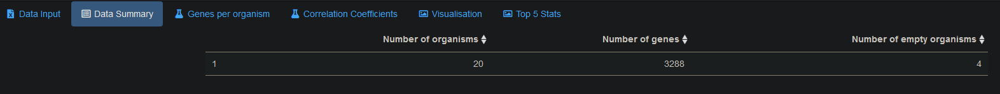
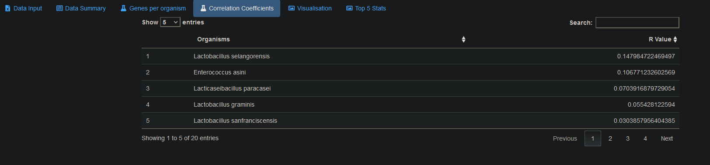
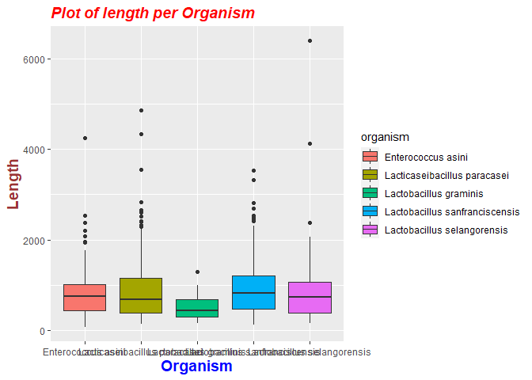
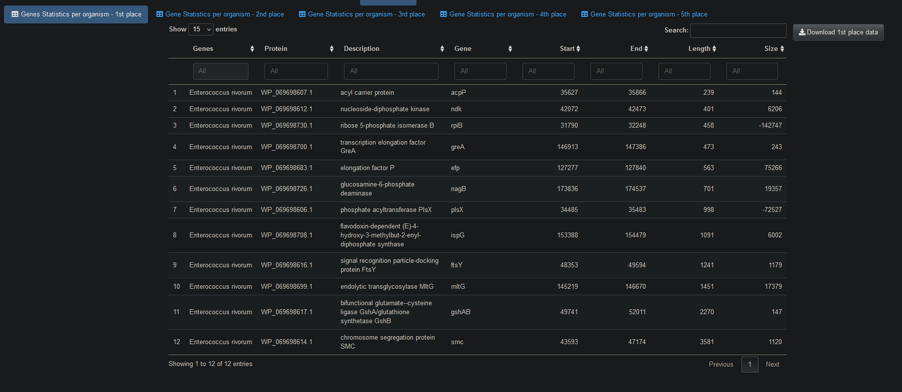
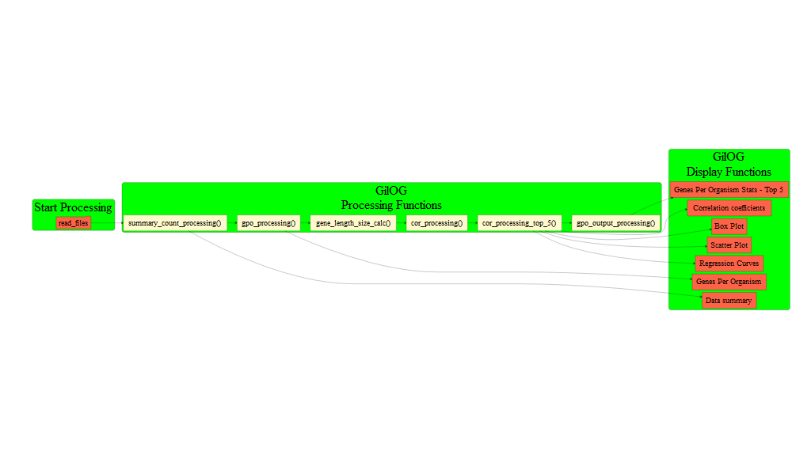

GilOG
================
Edward Gillian
27/05/2021

-----

<!-- README.md is generated from README.Rmd. Please edit that file -->

<!-- badges: start -->

<!-- badges: end -->

The package `GilOG` does a number of tasks:

First, this package uses calculates gene length and size.

Next, this package calculates correlation efficients and displays the
data in a boxplot, scatterplot, regression lines, correlation
efficients, both overall and Top 5.

It executes the processing using R Shiny’s reactivity functionality
using HTML coding in `ui.R` and `global.R` to improve the appearance of
the UI.

## Installation

You can install the released version of `GilOG` with:

``` r
devtools::install_github("EdwardJGillian/GilOG")
```

## Running the package

You can run `GilOG` by opening `global.R` in the `GilOG/inst` folder.

## Example

This is a basic example of the workflow with package functions. We will
start by getting the data needed for the package:

``` r
library(dplyr)
#> Warning: package 'dplyr' was built under R version 4.0.5
#> 
#> Attaching package: 'dplyr'
#> The following objects are masked from 'package:stats':
#> 
#>     filter, lag
#> The following objects are masked from 'package:base':
#> 
#>     intersect, setdiff, setequal, union
library(tidyr)
#> Warning: package 'tidyr' was built under R version 4.0.5
library(ggplot2)
#> Warning: package 'ggplot2' was built under R version 4.0.5
library(GilOG)
# There are two example files within the package: 
# set the file paths and file names
org_file_path <- system.file("extdata", "organisms.csv", package = "GilOG", mustWork = TRUE)
# org_file_path <- file.path(home, "extdata/organism.rds")
gene_file_path <- system.file("extdata", "genes.csv", package = "GilOG", mustWork = TRUE)

# load organism data and convert empty strings to NA
organism <- read.csv(org_file_path, na.strings = "")
# load genes data and convert empty strings to NA
genes <- read.csv(gene_file_path, na.strings = "")
```

The `GilOG` package loads two files `organism` and `genes` and validates
them for number of columns and column headings. Examples can be found in
the `inst/extdata` folder.

First, we will prepare the summary data count:

``` r
# Data summary count
summary_count_df <- GilOG::summary_count_processing(organism, genes)

head(summary_count_df)
#>   org_count gen_count eo_count
#> 1        20      3288        4
```

### Screenshot of Data summary



Next, we will prepare the genes per organism count:

``` r
# Genes per organism count
gpo_count_df <- GilOG::gpo_processing(organism, genes)
head(gpo_count_df)
#> # A tibble: 6 x 2
#> # Groups:   organism [6]
#>   organism                     gpo_count
#>   <chr>                            <int>
#> 1 Enterococcus asini                 119
#> 2 Enterococcus rivorum               162
#> 3 Enterococcus termitis              107
#> 4 Lacticaseibacillus paracasei       327
#> 5 Lactobacillus algidus              206
#> 6 Lactobacillus backii                 1
```

### Screenshot of genes per organism

 Next, we will prepare the genes lengths and
sizes:

``` r
# create data frame with gene lengths and sizes
gpo_length_size <- GilOG::gene_length_size_calc(organism, genes)
head(gpo_length_size)
#>             organism        assembly protein_id  protein_description gene_name
#> 1 Enterococcus asini GCA_009917315.1 NBK08599.1 hypothetical protein      <NA>
#> 2 Enterococcus asini GCA_009917315.1 NBK08600.1                holin      <NA>
#> 3 Enterococcus asini GCA_009917315.1 NBK08601.1 hypothetical protein      <NA>
#> 4 Enterococcus asini GCA_009917315.1 NBK08602.1 hypothetical protein      <NA>
#> 5 Enterococcus asini GCA_009917315.1 NBK08603.1   DNA repair protein      <NA>
#> 6 Enterococcus asini GCA_009917315.1 NBK08604.1   cold-shock protein      <NA>
#>   location_start location_end gene_length gene_size
#> 1              1          246         245         1
#> 2            294          692         398        48
#> 3           1708         2172         464      1016
#> 4           2220         2555         335        48
#> 5           2764         3054         290       209
#> 6           3206         3406         200       152
```

Next, we will calculate correlation coefficients:

``` r
# calculate correlation coefficients
co_ef_df <- GilOG::cor_processing(gpo_length_size)
head(co_ef_df)
#> # A tibble: 6 x 2
#>   organism                             r
#>   <chr>                            <dbl>
#> 1 Lactobacillus selangorensis    0.0991 
#> 2 Lacticaseibacillus paracasei   0.0738 
#> 3 Lactobacillus graminis         0.0556 
#> 4 Enterococcus asini             0.0475 
#> 5 Lactobacillus sanfranciscensis 0.0126 
#> 6 Listeria marthii               0.00308
```

### Screenshot of correlation coefficients



Next, we will calculate top 5 correlation coefficients:

``` r
# calculate correlation coefficients top 5
gpo_length_size_top_5 <- GilOG::cor_processing_top_5(gpo_length_size)
head(gpo_length_size_top_5)
#> # A tibble: 6 x 10
#> # Groups:   organism [1]
#>   organism           assembly protein_id protein_descrip~ gene_name location_start
#>   <chr>              <chr>    <chr>      <chr>            <chr>              <int>
#> 1 Enterococcus asini GCA_009~ NBK08599.1 hypothetical pr~ <NA>                   1
#> 2 Enterococcus asini GCA_009~ NBK08600.1 holin            <NA>                 294
#> 3 Enterococcus asini GCA_009~ NBK08601.1 hypothetical pr~ <NA>                1708
#> 4 Enterococcus asini GCA_009~ NBK08602.1 hypothetical pr~ <NA>                2220
#> 5 Enterococcus asini GCA_009~ NBK08603.1 DNA repair prot~ <NA>                2764
#> 6 Enterococcus asini GCA_009~ NBK08604.1 cold-shock prot~ <NA>                3206
#> # ... with 4 more variables: location_end <int>, gene_length <int>,
#> #   gene_size <dbl>, group_id <int>
```

Next, we will calculate and display the box plot

``` r
# calculate and display box plot
      gpo_box <- gpo_length_size_top_5 %>%
         dplyr::mutate_at(vars(organism), as.factor)
p <- ggplot2::ggplot(gpo_box, aes(x=organism, y=gene_length, fill=organism)) +
            geom_boxplot() +
            labs(title="Plot of length per Organism",x="Organism", y = "Length")
         p + theme(
            plot.title = element_text(color="red", size=14, face="bold.italic"),
            axis.title.x = element_text(color="blue", size=14, face="bold"),
            axis.title.y = element_text(color="#993333", size=14, face="bold")
         )
```



Next, we will calculate and display the scatterplot

``` r
# calculate and display correlation coefficients in a scatterplot
      GilOG::cor_scatterplot(gpo_length_size_top_5)
#> `geom_smooth()` using formula 'y ~ x'
```


Next, we will calculate and display the Regression Curves

``` r
p <- ggplot2::ggplot(gpo_length_size_top_5, aes(x=gene_size, y=gene_length, color=organism)) +
            geom_point() +
            geom_smooth(method = "lm", fill = NA) +
            geom_smooth(method = 'lm',size = 1, colour = 'black', se = F, linetype = "dashed") + theme_bw() +
            labs(title="Regression Curves per Organism",x="Size", y = "Length")
         p + theme(
            plot.title = element_text(color="red", size=14, face="bold.italic"),
            axis.title.x = element_text(color="blue", size=14, face="bold"),
            axis.title.y = element_text(color="#993333", size=14, face="bold")
         )
#> `geom_smooth()` using formula 'y ~ x'
#> `geom_smooth()` using formula 'y ~ x'
```


Finally, tables of gene statistics per organism are displayed for the
top 5 correlation coefficients.

``` r
# calculate correlation coefficients top 5 - 1st place
group_id <- as.double(1)
top_5_coef_display_1st_place <- GilOG::gpo_output_processing(gpo_length_size_top_5, group_id)
head(top_5_coef_display_1st_place)
#> # A tibble: 6 x 8
#> # Groups:   organism [1]
#>   organism   protein_id protein_descripti~ gene_name location_start location_end
#>   <chr>      <chr>      <chr>              <chr>              <int>        <int>
#> 1 Enterococ~ NBK08646.1 peptide chain rel~ prfB               44535        44606
#> 2 Enterococ~ NBK08628.1 DNA-directed RNA ~ <NA>               24585        24761
#> 3 Enterococ~ NBK08691.1 30S ribosomal pro~ <NA>               90019        90195
#> 4 Enterococ~ NBK08604.1 cold-shock protein <NA>                3206         3406
#> 5 Enterococ~ NBK08716.1 hypothetical prot~ <NA>              118505       118710
#> 6 Enterococ~ NBK08607.1 DUF1447 family pr~ <NA>                5952         6164
#> # ... with 2 more variables: gene_length <int>, gene_size <dbl>
```



## Organisgenes flowchart

This flowchart shows the package workflow visually.



### GilOG package input parameters

    #> Warning: package 'knitr' was built under R version 4.0.5
    #> Warning: package 'kableExtra' was built under R version 4.0.5
    #> 
    #> Attaching package: 'kableExtra'
    #> The following object is masked from 'package:dplyr':
    #> 
    #>     group_rows
    #> Warning: package 'magrittr' was built under R version 4.0.3
    #> 
    #> Attaching package: 'magrittr'
    #> The following object is masked from 'package:tidyr':
    #> 
    #>     extract

<table class="table table-striped" style="font-size: 10px; ">

<thead>

<tr>

<th style="text-align:left;font-weight: bold;font-style: italic;background-color: red !important;">

File

</th>

<th style="text-align:left;font-weight: bold;font-style: italic;background-color: red !important;">

DataType

</th>

</tr>

</thead>

<tbody>

<tr>

<td style="text-align:left;">

organism

</td>

<td style="text-align:left;">

CSV

</td>

</tr>

<tr>

<td style="text-align:left;">

genes

</td>

<td style="text-align:left;">

CSV

</td>

</tr>

</tbody>

</table>

### GilOG package Function Parameters

<table class="table table-striped" style="font-size: 10px; ">

<thead>

<tr>

<th style="text-align:left;font-weight: bold;font-style: italic;background-color: green !important;">

Function

</th>

<th style="text-align:left;font-weight: bold;font-style: italic;background-color: green !important;">

Function.Purpose

</th>

</tr>

</thead>

<tbody>

<tr>

<td style="text-align:left;">

summary\_count\_processing()

</td>

<td style="text-align:left;">

creates the a dataframe with the counts in various categories

</td>

</tr>

<tr>

<td style="text-align:left;">

gpo\_processing()

</td>

<td style="text-align:left;">

Create genes per organism count

</td>

</tr>

<tr>

<td style="text-align:left;">

gene\_length\_size\_calc()

</td>

<td style="text-align:left;">

Calculates the gene length and size

</td>

</tr>

<tr>

<td style="text-align:left;">

cor\_processing()

</td>

<td style="text-align:left;">

Performs correlation calculations

</td>

</tr>

<tr>

<td style="text-align:left;">

cor\_processing\_top\_5()

</td>

<td style="text-align:left;">

Performs correlation calculations to find the 5 strongest relationships

</td>

</tr>

<tr>

<td style="text-align:left;">

gpo\_output\_processing()

</td>

<td style="text-align:left;">

This function prepares output stats for the GPO stats tables by
filtering the data by group ID

</td>

</tr>

</tbody>

</table>

## Testing the package

As shown by the code below, a chained function using `purrr::map2` is
created to loop through two file lists of example data to test the core
functions to be tested for reliable outputs. This function creates a
series of reference files automatically

    library(GilOG)
    library(testthat)
    
    test_chained_functions <- function(csv_file1, csv_file2) {
       test_that("check file values for parameters", {
          # naming helper
          tname <- function(n) {
             paste0(home,
                    "/data/known_value/",
                    csv,
                    ".",
                    n,
                    ".test"
             )
          }
    
          # create file path to csv file examples
    
          csv_path1 <-
             paste0(home, "/data/csv_examples/", csv_file1)
          csv <- stringr::str_remove(csv_file1, ".csv")
          df1 <- read.csv(file=csv_path1, na.strings = "")
    
          csv_path2 <-
             paste0(home, "/data/csv_examples/", csv_file2)
          df2 <- read.csv(file=csv_path2, na.strings = "")
    
          organism <- GilOG::dataframe_preprocessing(df1)
    
          # SuppressWarnings used as expect_known_value is a deprecated function
          suppressWarnings(testthat::expect_known_value(
             organism, tname("organism")))
    
          genes <- GilOG::dataframe_preprocessing(df2)
    
          # SuppressWarnings used as expect_known_value is a deprecated function
          suppressWarnings(testthat::expect_known_value(
             genes, tname("genes")))
    
          # dplyr needs to be run inside testthat for function to work
          # generates a warning
          suppressWarnings(library(dplyr))
          summary_count_df <- GilOG::summary_count_processing(organism, genes)
    
          # SuppressWarnings used as expect_known_value is a deprecated function
          suppressWarnings(testthat::expect_known_value(
             summary_count_df, tname("summary_count_df")))
    
          gpo_length_size <- GilOG::gene_length_size_calc(organism, genes)
    
          # SuppressWarnings used as expect_known_value is a deprecated function
          suppressWarnings(testthat::expect_known_value(
             gpo_length_size, tname("gpo_length_size")))
    
          co_ef_df <- GilOG::cor_processing(gpo_length_size)
    
          # SuppressWarnings used as expect_known_value is a deprecated function
          suppressWarnings(testthat::expect_known_value(
             co_ef_df, tname("co_ef_df")))
    
          gpo_length_size_top_5 <- GilOG::cor_processing_top_5(gpo_length_size)
    
          # SuppressWarnings used as expect_known_value is a deprecated function
          suppressWarnings(testthat::expect_known_value(
             gpo_length_size_top_5, tname("gpo_length_size_top_5")))
    
       })
    }
    
    # create the ALS file path
    home <- setwd(Sys.getenv("HOME"))
    
    
    csv_file_path <- file.path(getwd())
    csv_file_path <- file.path(home, "data/csv_examples")
    
    # create organism as test1.csv and genes as test2
    csv_files_list1 <- list.files(path = csv_file_path, pattern = "organisms*", full.names = FALSE)
    csv_files_list2 <- list.files(path = csv_file_path, pattern = "genes*", full.names = FALSE)
    
    # apply 1 list vector to the function
    # apply 2 list vector to function +
    purrr::map2(csv_files_list1, csv_files_list2, test_chained_functions)

### Testthat results:

``` r
library(testthat)
#> Warning: package 'testthat' was built under R version 4.0.5
#> 
#> Attaching package: 'testthat'
#> The following objects are masked from 'package:magrittr':
#> 
#>     equals, is_less_than, not
#> The following object is masked from 'package:tidyr':
#> 
#>     matches
#> The following object is masked from 'package:dplyr':
#> 
#>     matches
library(dplyr)
library(magrittr)
library(GilOG)
test_results_raw <- testthat::test_file("tests/testthat/test-chained_function_known_value.R", reporter = testthat::ListReporter)

test_results_individual <- test_results_raw %>%
  as_tibble() %>%
  dplyr::rename(Test = test) %>%
  dplyr::group_by(file, context, Test) %>%
  dplyr::summarise(NumTests = first(nb),
            Passed   = sum(passed),
            Failed   = sum(failed),
            Warnings = sum(warning),
            Errors   = sum(as.numeric(error)),
            Skipped  = sum(as.numeric(skipped)),
            .groups = "drop")

summarise_results <- function(res) {
  res %>% dplyr::summarise_if(is.numeric, sum) %>% knitr::kable()
  }

summarise_results(test_results_individual)
```

<table>

<thead>

<tr>

<th style="text-align:right;">

NumTests

</th>

<th style="text-align:right;">

Passed

</th>

<th style="text-align:right;">

Failed

</th>

<th style="text-align:right;">

Warnings

</th>

<th style="text-align:right;">

Errors

</th>

<th style="text-align:right;">

Skipped

</th>

</tr>

</thead>

<tbody>

<tr>

<td style="text-align:right;">

11

</td>

<td style="text-align:right;">

22

</td>

<td style="text-align:right;">

0

</td>

<td style="text-align:right;">

0

</td>

<td style="text-align:right;">

0

</td>

<td style="text-align:right;">

0

</td>

</tr>

</tbody>

</table>

## Running the package

You can run `GilOG` by opening `global.R` in the `GilOG/inst` folder.
